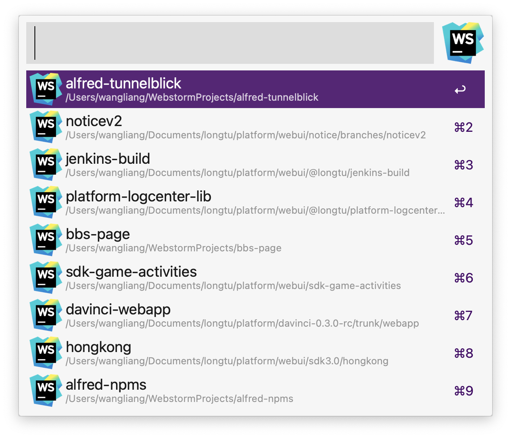
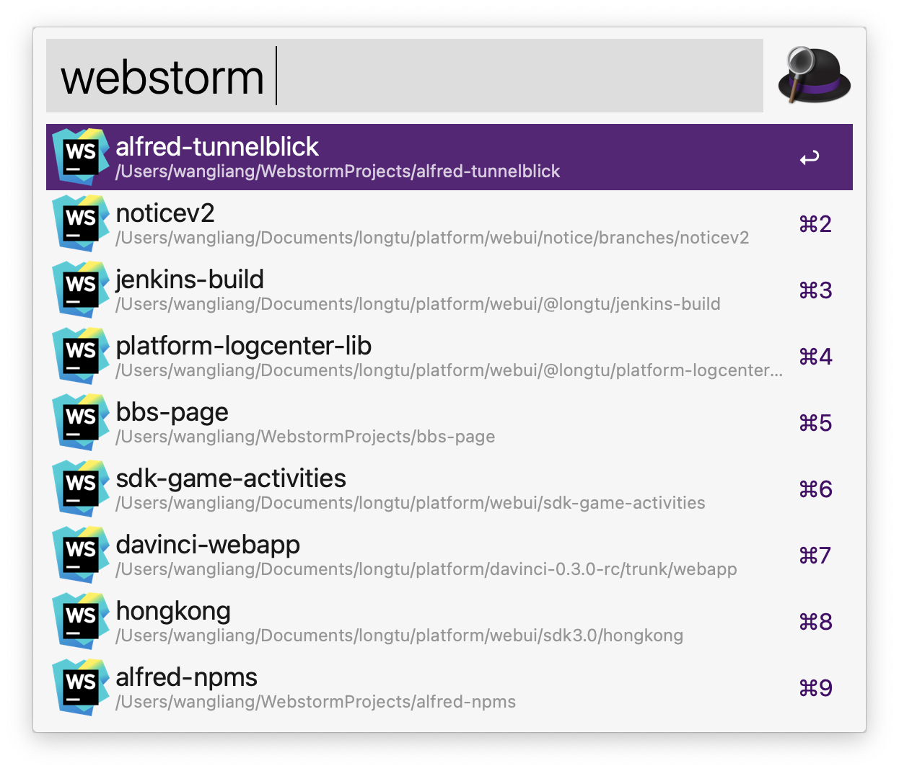
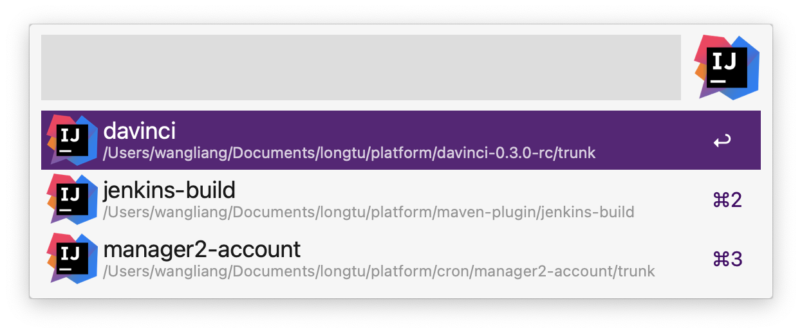
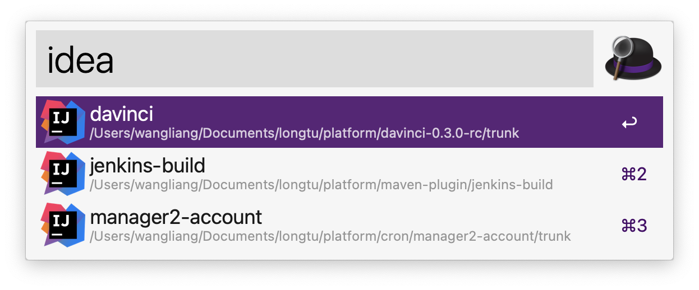
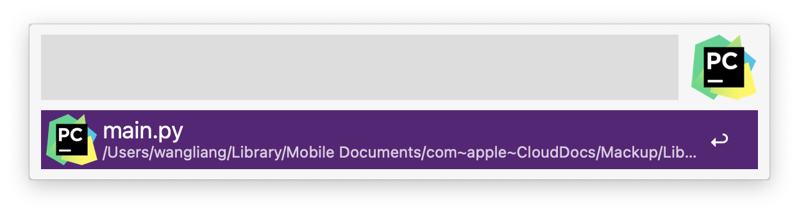

## @liangshen/alfred-jetbrains

*Alfred工作流，快速启动Jetbrains系软件中打开过的项目*
*Alfred workflow for Jetbrains*

### 运行环境

* MacOS
* Nodejs 14.x.x
* Alfred Powerpack
* Jetbrains (Webstorm Idea Pycharm)

### 安装

```
npm i -g @liangshen/alfred-jenkins
```

### 使用方法

目前只支持Webstorm Idea Pycharm三种IDE

可使用 option + W 快捷键调出Webstorm工作流搜索框(或者调出alfred搜索框输入关键字 webstorm)

回车可使用Webstorm打开项目, 按住Command键回车可在Finder中打开项目




可使用 option + I 快捷键调出Idea工作流搜索框(或者调出alfred搜索框输入关键字 idea)

回车可使用Idea打开项目, 按住Command键回车可在Finder中打开项目



可使用 option + P 快捷键调出Pycharm工作流搜索框(或者调出alfred搜索框输入关键字 pycharm)

回车可使用Pycharm打开项目, 按住Command键回车可在Finder中打开项目



